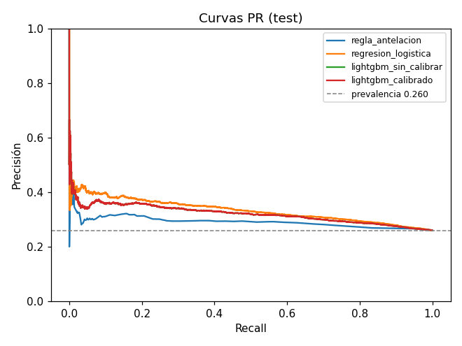
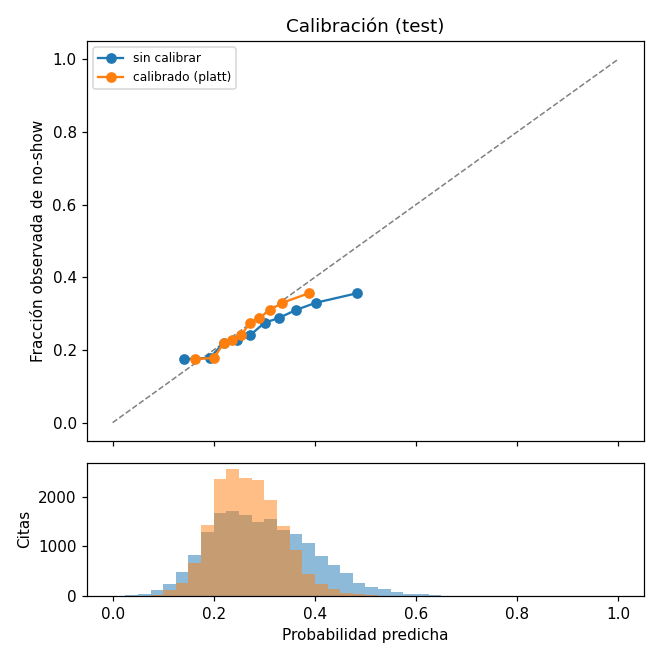
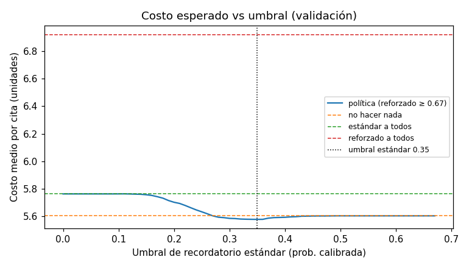
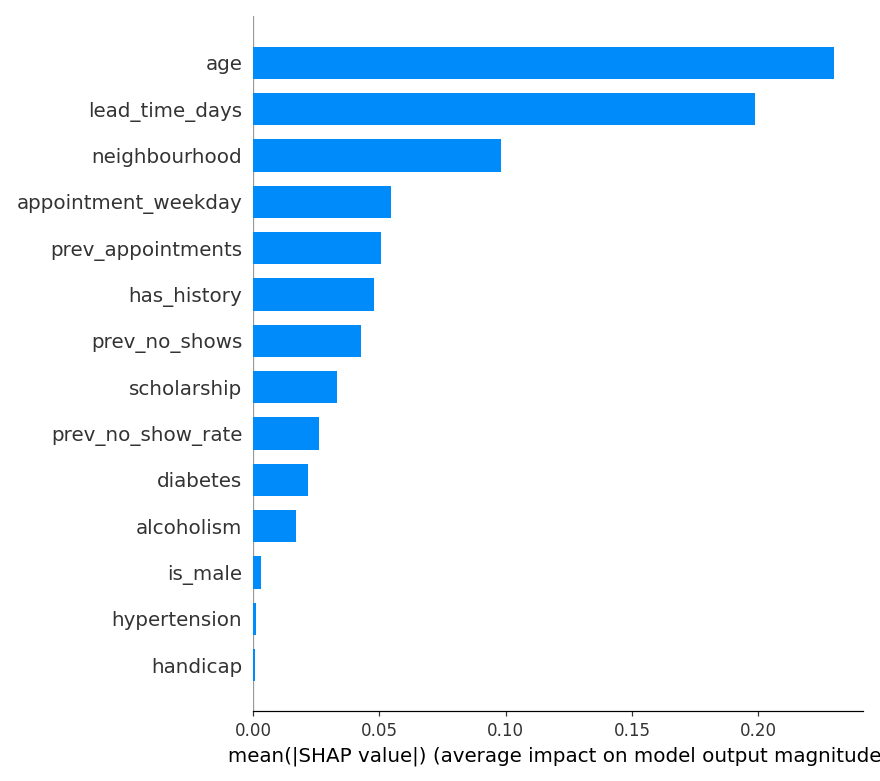

# noshow-guard

Simulador local de agendamiento: dado un paciente, una fecha y una hora, estima la probabilidad calibrada de inasistencia (no-show), recomienda una acción de recordatorio y explica el caso. Nada se agenda de verdad y nada sale de la máquina.

> Estado: Fase 3 cerrada (modelado y evaluación). El README completo se construye en la Fase 8.

## Requisitos

- [uv](https://docs.astral.sh/uv/) 0.8.x (instala Python 3.11 automáticamente)
- GNU Make (en Windows: `winget install ezwinports.make`)

## Inicio rápido

```bash
make setup      # dependencias exactas desde uv.lock
make test
make lint       # ruff + mypy
make data       # verifica hash, limpia y valida -> data/processed/appointments_clean.parquet
make features   # features sin fuga + split cronológico -> data/processed/features/
make eda        # ejecuta notebooks/01_eda.ipynb
```

## Datos

Dataset público [Medical Appointment No Shows](https://www.kaggle.com/datasets/joniarroba/noshowappointments) (Kaggle, CC BY-NC-SA 4.0). El CSV va en `data/raw/data.csv` y no se versiona. Las reglas de limpieza, la fuente y las limitaciones están en [docs/data_quality.md](docs/data_quality.md).

## Features

Todas salen de una sola función, `build_features(cita, historial, as_of)` en `src/noshow_guard/features.py`, que usan tanto el entrenamiento como el simulador. `as_of` es el momento de la predicción. En los datos históricos es la fecha de `ScheduledDay`.

| Feature | Definición |
|---|---|
| `lead_time_days` | Días calendario desde `as_of` hasta la cita. No usa horas, porque la cita no las tiene |
| `appointment_weekday` | De 0 (lunes) a 4 (viernes). El fin de semana se agrupa con el viernes, porque el único sábado es una sola fecha con 31 citas |
| `age`, `is_male`, `scholarship`, `hypertension`, `diabetes`, `alcoholism`, `handicap` | Atributos del paciente. `handicap` es un conteo de 0 a 4 |
| `neighbourhood` | Texto crudo. Se codifica con target encoding suavizado dentro del modelo, ajustado solo con train (Fase 3) |
| `has_history`, `prev_appointments`, `prev_no_shows`, `prev_no_show_rate` | Historial del paciente, contando solo citas con fecha **estrictamente anterior** a `as_of`. Si no hay historial, todo vale 0 y `has_history = 0` |

Se excluyen a propósito:
- `sms_received`, porque es una intervención confundida con la antelación.
- Mes y año, porque son fechas absolutas que no generalizan.
- La hora de la cita, que no existe en los datos.
- Las citas del mismo día (antelación 0), que quedan fuera del alcance del modelo.

**Garantías contra la fuga**, cubiertas en `tests/test_features.py`:
- El historial de una cita no incluye la propia cita, ni citas posteriores, ni citas del mismo día de `as_of`.
- Cambiar el resultado de una cita no cambia sus features.
- Cambiar resultados futuros no cambia las features de citas anteriores.
- `build_features` filtra el historial por sí misma, así que pasarle citas futuras no produce fuga.

Además, se recalculó el historial por fuerza bruta en 2.000 citas reales al azar y no hubo ninguna diferencia.

## Split temporal

El split es cronológico por fecha de cita y no aleatorio. El modelo se usará para predecir citas futuras con lo aprendido del pasado, y un split aleatorio mezclaría citas de la misma semana en train y test. Eso infla las métricas con patrones de fechas concretas y deja que el historial de un paciente vea el futuro.

Un mismo paciente puede aparecer en train y en test, porque en producción los pacientes vuelven. Su historial siempre se calcula sin fuga, y las métricas se reportarán por separado para citas con y sin historial.

Resultados de `make features` (`reports/split_summary.json`, solo citas con antelación de 1 día o más):

| Split | Fechas de cita | Citas | % | No-show | Con historial | Paciente visto en train |
|---|---|---|---|---|---|---|
| train | 2016-04-29 a 2016-05-20 (17 días) | 43.937 | 61,1 % | 29,64 % | 13,0 % | 100 % |
| val | 2016-05-24 a 2016-05-31 (4 días) | 10.671 | 14,8 % | 28,01 % | 32,9 % | 44,5 % |
| test | 2016-06-01 a 2016-06-08 (6 días) | 17.344 | 24,1 % | 26,00 % | 41,5 % | 42,0 % |

Hay dos cambios de distribución entre splits, y son reales, no errores:
- **La tasa base baja** de 29,6 % a 26,0 %. Las métricas que dependen de la prevalencia, como PR-AUC, no son comparables entre splits sin tenerlo en cuenta.
- **La proporción de citas con historial se triplica**, del 13 % al 41 %. Es un efecto de la ventana recortada: el dataset empieza el 2016-04-29, así que las citas tempranas casi nunca tienen historial. El modelo aprende las features de historial con relativamente pocos ejemplos.

## Modelado y resultados (Fase 3)

```bash
make train   # -> models/<fecha>_<hash>.joblib, models/metadata.json, reports/metrics.json, reports/figures/
```

**Modelo principal: regresión logística calibrada (Platt).** LightGBM queda como comparación. Esta decisión se tomó **después de ver test** y se explica en [ADR 0001](docs/adr/0001-modelo-principal.md). En resumen:
- En PR-AUC de validación los dos modelos empatan: 0,3522 contra 0,3522.
- En 3 cortes temporales con origen móvil, que no usan test, no hay ganador consistente (LightGBM +0,007, −0,001 y 0,000).
- Ante un empate se prefiere el modelo más simple y explicable.
- No se hizo otra selección de LightGBM contra test.

Reparto de datos:
- **Train:** ajuste de los modelos.
- **Validación:** hiperparámetros de LightGBM (30 configuraciones aleatorias con early stopping), elección y ajuste del calibrador, y umbrales.
- **Test:** solo reporte.

### Resultados en test

Son 17.344 citas, entre el 2016-06-01 y el 2016-06-08, con prevalencia de 26,0 %. Las cifras son de `reports/metrics.json` y no están redondeadas a favor.

| Modelo | PR-AUC | ROC-AUC | Brier | Log-loss |
|---|---|---|---|---|
| Clase mayoritaria (prob. = prevalencia de train) | 0,2600 | 0,5000 | 0,1937 | 0,5763 |
| Regla de antelación (`lead ≥ 2`, k elegido por F1 en train) | 0,2899 | 0,5494 | n/a | n/a |
| Regresión logística sin calibrar | 0,3337 | 0,6026 | 0,1890 | 0,5638 |
| **Regresión logística calibrada (principal)** | **0,3337** | **0,6026** | **0,1878** | **0,5610** |
| LightGBM sin calibrar (comparación) | 0,3209 | 0,5888 | 0,1919 | 0,5706 |
| LightGBM calibrado (comparación) | 0,3209 | 0,5888 | 0,1891 | 0,5643 |

La señal es modesta. El modelo principal mejora la PR-AUC en 7,4 puntos sobre la prevalencia (0,334 contra 0,260), pero un ROC-AUC de 0,60 indica que separa mal a quien falta de quien asiste. Platt no cambia el orden de las predicciones (por eso PR-AUC y ROC-AUC no cambian), pero mejora el Brier. En la validación cruzada dentro de validación, el Brier fue 0,1984 sin calibrar, 0,1975 con isotónica y 0,1972 con Platt.





### Umbral por costo

Los costos **son supuestos, no datos**. Están en `CostConfig` de `config.py`, en unidades donde un recordatorio estándar cuesta 1:

| Parámetro | Valor supuesto |
|---|---|
| Hueco vacío (no-show) | 20 |
| Recordatorio estándar | 1 |
| Recordatorio reforzado con confirmación | 3 |
| Reducción relativa del no-show con estándar / reforzado | 15 % / 30 % |

Una acción conviene si `p > costo / (20 × efecto)`. Con probabilidades bien calibradas, el umbral analítico es 0,33 para el estándar y 0,67 para el reforzado. El umbral que minimiza el costo observado en validación es **0,35 para el estándar** y **0,67 para el reforzado**. Los empates se resuelven hacia el umbral analítico.

Una combinación anterior (hueco 10, efecto 10 %) hacía que recordar nunca conviniera, porque el ahorro esperado `10 × p × 0,1` nunca supera el costo de 1. `tests/test_evaluation.py` documenta ese caso.



| Costo medio por cita | Validación | Test |
|---|---|---|
| Política del modelo | 5,576 | 5,184 |
| No hacer nada | 5,602 | 5,199 |
| Estándar a todos | 5,762 | 5,420 |
| Reforzado a todos | 6,921 | 6,640 |

- Con estos supuestos, la política del modelo ahorra apenas un **0,3 % frente a no hacer nada** en test (0,016 unidades por cita), y es mejor que recordar a todos.
- En test, 1.854 citas (10,7 %) recibirían recordatorio estándar, con precisión de 0,382 y recall de 0,157.
- **El recordatorio reforzado no se activa en ninguna cita de test.** La probabilidad calibrada máxima es 0,606 en test y 0,507 en validación, ambas por debajo de 0,67. Los supuestos no se ajustaron para forzarlo.

### Explicabilidad (SHAP)

Los valores SHAP son exactos para el modelo lineal: `coef × (x − media de train)`, sumados por feature original, en log-odds sin calibrar. Se calcularon sobre 3.000 citas de test.



- Las features que más pesan son la **edad** (|SHAP| medio 0,230), la **antelación** (0,199) y el **barrio** (0,098). Les siguen el día de la semana y el historial.
- Los jóvenes y las citas con más antelación suben el riesgo. Tener muchas citas previas lo baja y tener no-shows previos lo sube. La beca, la diabetes y el alcoholismo lo suben un poco.
- Casos locales:
  - La probabilidad más alta (0,606) corresponde a un paciente con 8 no-shows en 8 citas previas.
  - La más baja (0,033) corresponde a un paciente con 56 citas previas.
- **Limitaciones de SHAP:**
  - Explica al modelo, no a la realidad. Que la antelación pese mucho no prueba que acortarla reduzca el no-show.
  - `prev_appointments` y `prev_no_shows` están correlacionadas. En el caso de 8 de 8, SHAP reparte el efecto entre ellas con signos opuestos (+1,34 y −0,34).
  - Los conteos entran de forma lineal, así que valores extremos como 56 citas previas generan contribuciones que son extrapolación.

### Errores por segmento y equidad (test)

La decisión es "cualquier recordatorio", con umbral 0,35.

| Segmento | Citas | No-show real | Prob. media | PR-AUC | Recall | FPR | % marcado |
|---|---|---|---|---|---|---|---|
| Sin historial | 10.148 | 27,0 % | 27,9 % | 0,335 | 0,170 | 0,104 | 12,2 % |
| Con historial | 7.196 | 24,6 % | 24,9 % | 0,333 | 0,137 | 0,069 | 8,6 % |
| Edad 0-17 | 3.840 | 29,4 % | 30,2 % | 0,330 | 0,194 | 0,152 | 16,4 % |
| Edad 18-35 | 3.808 | 32,2 % | 31,1 % | 0,377 | 0,292 | 0,210 | 23,6 % |
| Edad 36-55 | 4.842 | 25,2 % | 26,3 % | 0,318 | 0,102 | 0,052 | 6,4 % |
| Edad 56-75 | 3.911 | 18,8 % | 20,9 % | 0,254 | **0,009** | 0,002 | 0,3 % |
| Edad 76+ | 943 | 20,9 % | 20,4 % | 0,248 | **0,000** | 0,000 | 0,0 % |
| Mujer | 11.604 | 25,7 % | 26,6 % | 0,336 | 0,168 | 0,091 | 11,0 % |
| Hombre | 5.740 | 26,6 % | 26,9 % | 0,331 | 0,136 | 0,087 | 10,0 % |
| Sin beca | 15.807 | 25,5 % | 26,2 % | 0,321 | 0,121 | 0,072 | 8,5 % |
| Con beca | 1.537 | 31,4 % | 32,0 % | 0,412 | 0,454 | 0,278 | 33,3 % |

Entre mujeres y hombres las métricas son similares. Por edad y por beca, en cambio, hay diferencias grandes (ver las limitaciones).

### Limitaciones del modelo

1. **El historial cambia de distribución entre splits.** Tiene historial el 13,0 % de las citas de train, contra el 41,5 % de las de test. Es un efecto de la ventana recortada del dataset, que empieza el 2016-04-29. El modelo aprende las features de historial con pocos ejemplos, y en test pesan mucho más que en train.
2. **Casi no detecta a los mayores.** En la política de umbrales, el recall es de **0,9 % entre 56 y 75 años** y de **0 % en 76+**, aunque su no-show real es 18,8 % y 20,9 %. La probabilidad predicha casi nunca pasa el umbral en esos grupos, así que quienes faltan no recibirían recordatorio. Con LightGBM el recall de 56-75 era 0,05 y el problema era el mismo, algo menos extremo.
3. **Sesgo de asignación por edad y beca.** Se marca al 23,6 % de las citas de 18-35 años y al 0,3 % de las de 56-75. Con beca se marca el 33,3 %, contra 8,5 % sin beca. Esto refleja en parte tasas reales más altas (31,4 % contra 25,5 % en beca), pero amplifica la diferencia: el FPR con beca es casi 4 veces mayor (0,278 contra 0,072). Si la acción implicara una carga para el paciente, este sesgo necesitaría una revisión explícita. Un recordatorio tiene bajo costo para quien lo recibe, pero el sesgo sigue existiendo.
4. **Discriminación modesta** (ROC-AUC 0,60) y beneficio económico casi nulo bajo los supuestos de costo.
5. **Test ya no está limpio para el modelo principal**, porque la decisión se tomó después de verlo (ADR 0001).
