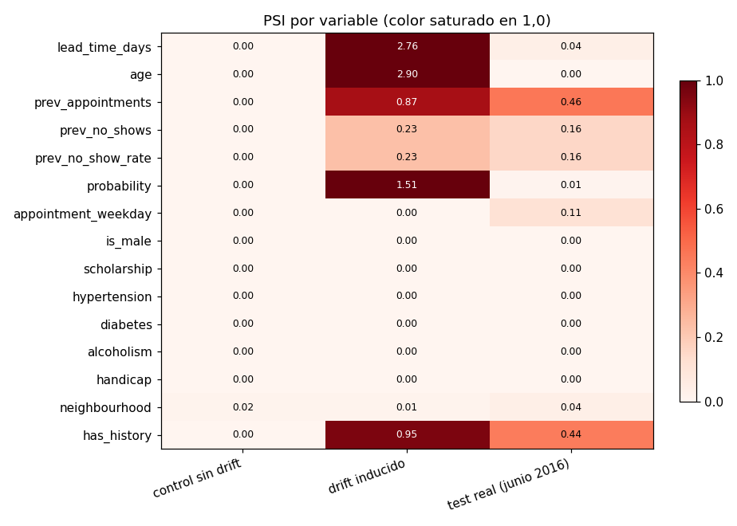
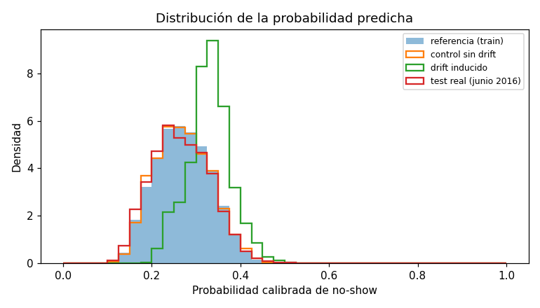

# Reporte de drift

- Generado: 2026-09-30 00:38 UTC
- Modelo: `20260929_c823f970`
- Referencia: features de **train** (43.937 citas) y su probabilidad predicha
- PSI < 0,10 estable · 0,10 a 0,25 vigilar · > 0,25 alerta
- Veredicto «reentrenar»: alerta en una variable clave (lead_time_days, age, has_history, probability). Es una señal para evaluar un reentrenamiento, no un reentrenamiento automático (ver `docs/retraining_plan.md`).
- Con menos de 100 filas no se emite veredicto.

## Resumen

| Lote | Filas | Veredicto | Variables en alerta | Variables a vigilar |
|---|---|---|---|---|
| simulaciones registradas | 2 | **muestra_insuficiente** | - | - |
| control sin drift | 5.000 | **estable** | - | - |
| drift inducido | 5.000 | **reentrenar** | lead_time_days, age, prev_appointments, probability, has_history | prev_no_shows, prev_no_show_rate |
| test real (junio 2016) | 17.344 | **reentrenar** | prev_appointments, has_history | prev_no_shows, prev_no_show_rate, appointment_weekday |

Los p-valores (KS y chi²) se muestran como referencia. Con miles de filas casi cualquier diferencia es estadísticamente significativa aunque sea irrelevante, por eso el veredicto usa el PSI.

## simulaciones registradas

Simulaciones guardadas en `data/simulations.db` (solo las que tienen probabilidad).

Solo 2 fila(s): muestra insuficiente para evaluar drift.

## control sin drift

Remuestreo con reemplazo de 5.000 citas de train. Debe salir estable.

| Variable | PSI | Estado | Prueba | p-valor | Referencia | Actual |
|---|---|---|---|---|---|---|
| lead_time_days | 0,003 | estable | KS | 0,933 | media 14,773 | media 14,830 |
| age | 0,003 | estable | KS | 0,374 | media 38,098 | media 38,686 |
| prev_appointments | 0,001 | estable | KS | 1,000 | media 0,246 | media 0,246 |
| prev_no_shows | 0,001 | estable | KS | 1,000 | media 0,046 | media 0,041 |
| prev_no_show_rate | 0,001 | estable | KS | 1,000 | media 0,028 | media 0,024 |
| probability | 0,001 | estable | KS | 0,115 | media 0,271 | media 0,270 |
| appointment_weekday | 0,001 | estable | chi² | 0,312 | 4 (22,5 %) | 4 (22,2 %) |
| is_male | 0,000 | estable | chi² | 0,210 | 0 (66,7 %) | 0 (67,6 %) |
| scholarship | 0,000 | estable | chi² | 0,898 | 0 (90,7 %) | 0 (90,7 %) |
| hypertension | 0,000 | estable | chi² | 0,203 | 0 (79,3 %) | 0 (78,5 %) |
| diabetes | 0,000 | estable | chi² | 0,356 | 0 (92,6 %) | 0 (92,2 %) |
| alcoholism | 0,000 | estable | chi² | 0,403 | 0 (97,5 %) | 0 (97,7 %) |
| handicap | 0,000 | estable | chi² | 0,928 | 0 (98,2 %) | 0 (98,1 %) |
| neighbourhood | 0,015 | estable | chi² | 0,767 | JARDIM CAMBURI (7,4 %) | JARDIM CAMBURI (6,8 %) |
| has_history | 0,000 | estable | chi² | 0,483 | 0 (87,0 %) | 0 (87,3 %) |

## drift inducido

Remuestreo de 5.000 citas de train con drift a propósito: antelación triplicada, edad a la mitad (población más joven) y todos los pacientes nuevos (sin historial).

| Variable | PSI | Estado | Prueba | p-valor | Referencia | Actual |
|---|---|---|---|---|---|---|
| lead_time_days | 2,759 | alerta | KS | < 0,001 | media 14,773 | media 45,285 |
| age | 2,899 | alerta | KS | < 0,001 | media 38,098 | media 18,776 |
| prev_appointments | 0,865 | alerta | KS | < 0,001 | media 0,246 | media 0,000 |
| prev_no_shows | 0,234 | vigilar | KS | < 0,001 | media 0,046 | media 0,000 |
| prev_no_show_rate | 0,234 | vigilar | KS | < 0,001 | media 0,028 | media 0,000 |
| probability | 1,506 | alerta | KS | < 0,001 | media 0,271 | media 0,330 |
| appointment_weekday | 0,001 | estable | chi² | 0,153 | 4 (22,5 %) | 4 (22,3 %) |
| is_male | 0,000 | estable | chi² | 0,351 | 0 (66,7 %) | 0 (66,0 %) |
| scholarship | 0,000 | estable | chi² | 0,249 | 0 (90,7 %) | 0 (90,2 %) |
| hypertension | 0,000 | estable | chi² | 0,659 | 0 (79,3 %) | 0 (79,6 %) |
| diabetes | 0,000 | estable | chi² | 0,654 | 0 (92,6 %) | 0 (92,8 %) |
| alcoholism | 0,002 | estable | chi² | 0,004 | 0 (97,5 %) | 0 (96,8 %) |
| handicap | 0,000 | estable | chi² | 0,669 | 0 (98,2 %) | 0 (98,4 %) |
| neighbourhood | 0,012 | estable | chi² | 0,966 | JARDIM CAMBURI (7,4 %) | JARDIM CAMBURI (7,7 %) |
| has_history | 0,953 | alerta | chi² | < 0,001 | 0 (87,0 %) | 0 (100,0 %) |

## test real (junio 2016)

Citas reales de test (2016-06-01 a 2016-06-08): el drift que de verdad ocurrió después del periodo de entrenamiento.

| Variable | PSI | Estado | Prueba | p-valor | Referencia | Actual |
|---|---|---|---|---|---|---|
| lead_time_days | 0,037 | estable | KS | < 0,001 | media 14,773 | media 16,003 |
| age | 0,003 | estable | KS | < 0,001 | media 38,098 | media 39,143 |
| prev_appointments | 0,461 | alerta | KS | < 0,001 | media 0,246 | media 1,070 |
| prev_no_shows | 0,156 | vigilar | KS | < 0,001 | media 0,046 | media 0,205 |
| prev_no_show_rate | 0,156 | vigilar | KS | < 0,001 | media 0,028 | media 0,089 |
| probability | 0,009 | estable | KS | < 0,001 | media 0,271 | media 0,267 |
| appointment_weekday | 0,112 | vigilar | chi² | < 0,001 | 4 (22,5 %) | 2 (33,9 %) |
| is_male | 0,000 | estable | chi² | 0,646 | 0 (66,7 %) | 0 (66,9 %) |
| scholarship | 0,000 | estable | chi² | 0,075 | 0 (90,7 %) | 0 (91,1 %) |
| hypertension | 0,000 | estable | chi² | 0,186 | 0 (79,3 %) | 0 (78,8 %) |
| diabetes | 0,000 | estable | chi² | 0,445 | 0 (92,6 %) | 0 (92,4 %) |
| alcoholism | 0,000 | estable | chi² | 0,436 | 0 (97,5 %) | 0 (97,4 %) |
| handicap | 0,000 | estable | chi² | 0,153 | 0 (98,2 %) | 0 (98,2 %) |
| neighbourhood | 0,036 | estable | chi² | < 0,001 | JARDIM CAMBURI (7,4 %) | JARDIM CAMBURI (7,0 %) |
| has_history | 0,442 | alerta | chi² | < 0,001 | 0 (87,0 %) | 0 (58,5 %) |
