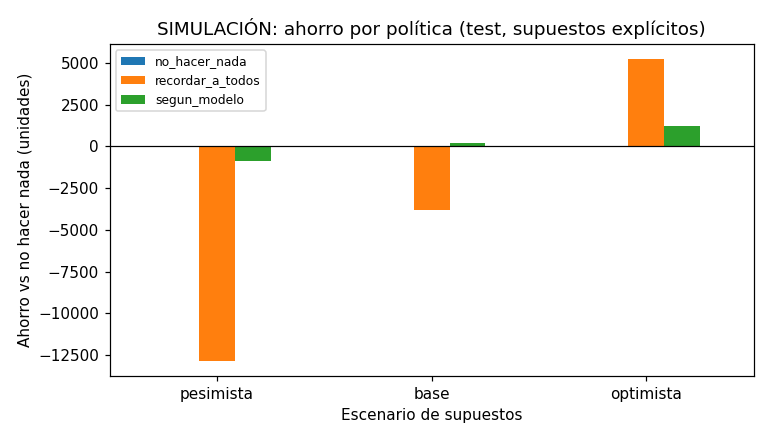

# Simulación de impacto de recordatorios

> **SIMULACIÓN, NO RESULTADO REAL.** Los efectos de los recordatorios son supuestos configurables (`ImpactConfig` en `config.py`); no se estimaron con datos. Las cifras dicen qué pasaría *si* los supuestos fueran ciertos.

- Citas: test real, 17.344 citas del 2016-06-01 al 2016-06-08, con su resultado observado.
- Modelo: `20260929_c823f970`. Umbrales fijos (elegidos en validación con el escenario base): recordatorio estándar si p ≥ 0,36, reforzado si p ≥ 0,67.
- Costos supuestos (unidades, 1 = un recordatorio estándar): hueco vacío 20, estándar 1, reforzado 3.

## Supuestos de efecto (reducción relativa del no-show)

| Escenario | Recordatorio estándar | Reforzado con confirmación |
|---|---|---|
| pesimista | 5 % | 10 % |
| base | 15 % | 30 % |
| optimista | 25 % | 45 % |

Como referencia no causal: en el EDA, dentro de cada tramo de antelación, las citas con SMS tuvieron entre 10 % y 25 % menos no-show relativo que las sin SMS. El SMS no se asignó al azar, así que eso no mide su efecto.

## Resultados

| Escenario | Política | Recordatorios | No-shows evitados (esperados) | Evitados por 100 recordatorios | Costo total | Ahorro vs no hacer nada |
|---|---|---|---|---|---|---|
| pesimista | no_hacer_nada | 0 | 0,0 de 4.509 | 0,0 | 90.180 | 0 |
| pesimista | recordar_a_todos | 17.344 | 225,5 de 4.509 | 1,3 | 103.015 | -12.835 |
| pesimista | segun_modelo | 1.420 | 26,6 de 4.509 | 1,9 | 91.068 | -888 |
| base | no_hacer_nada | 0 | 0,0 de 4.509 | 0,0 | 90.180 | 0 |
| base | recordar_a_todos | 17.344 | 676,3 de 4.509 | 3,9 | 93.997 | -3.817 |
| base | segun_modelo | 1.420 | 79,8 de 4.509 | 5,6 | 90.004 | 176 |
| optimista | no_hacer_nada | 0 | 0,0 de 4.509 | 0,0 | 90.180 | 0 |
| optimista | recordar_a_todos | 17.344 | 1.127,2 de 4.509 | 6,5 | 84.979 | 5.201 |
| optimista | segun_modelo | 1.420 | 133,0 de 4.509 | 9,4 | 88.940 | 1.240 |

